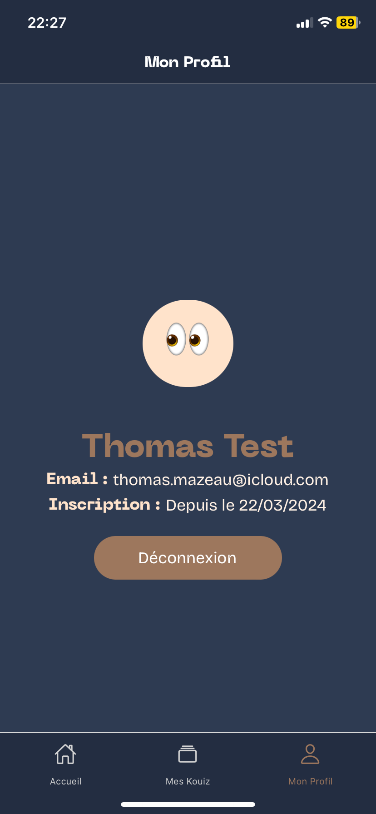

# Kouiz
#### _Quand la création de quiz s'actualise_


## Description

Cette application est une application React Native qui permet aux utilisateurs de :

- Créer un compte
- Se connecter
- Voir des quiz (bientôt)
- Répondre à des quiz (bientôt)
- Modifier son compte (bientôt)
- Supprimer son compte (bientôt)
- Se déconnecter

Cette application utilise Expo pour le développement et le déploiement.

## Maquettes/Aperçu





## Prérequis

Avant de commencer, assurez-vous d'avoir installé Node.js et npm sur votre machine. Vous aurez également besoin d'Expo CLI. Vous pouvez l'installer en exécutant la commande suivante :

```bash
npm install -g expo-cli
```

## Installation
Pour installer l'application, suivez les étapes suivantes :

1. Télécharger sur votre smartphone l'application [Expo Go](https://expo.dev/go)
2. Clonez le dépôt :
```
git clone https://github.com/toms-beatz/kouiz-mobile.git
```
3. Accédez au dossier du projet :
```
cd kouiz-mobile
```
4. Installez les dépendances :
```
npm i
```

## Utilisation
Pour lancer l'application, exécutez la commande suivante :
```
npx expo start
```

Cela lancera le serveur et affichera un QR Code dans votre terminal de commande. Vous pouvez alors exécuter l'application sur un émulateur Android ou iOS, ou sur votre propre appareil en scannant le code QR avec l'application Expo Go.
